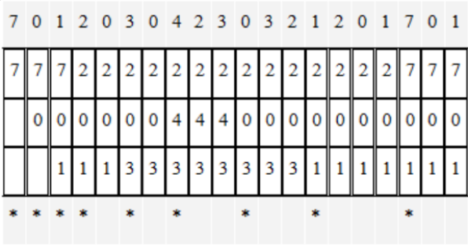
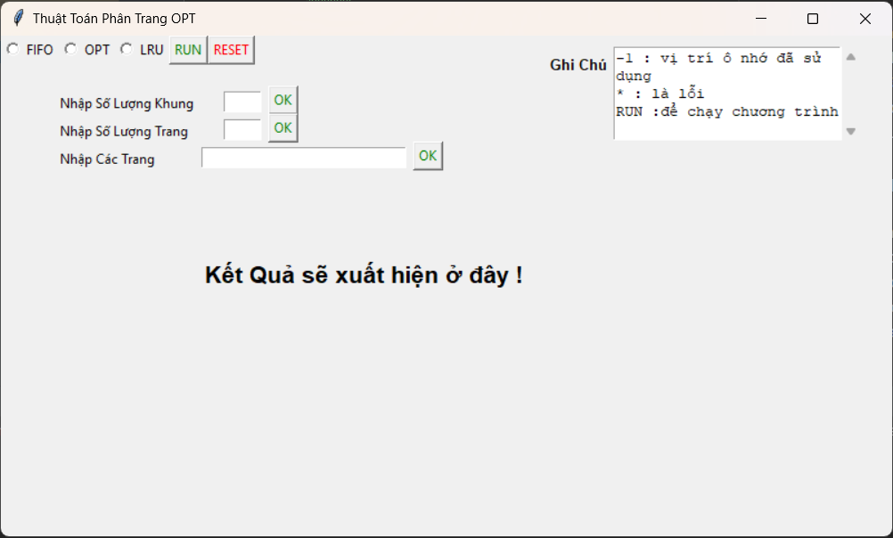
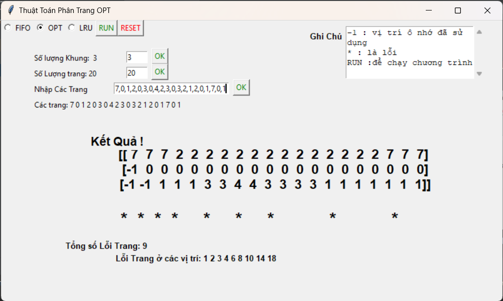

# Đề tài: Chương trình mô phỏng giải thuật thay thế trang theo thuật toán tối ưu.

##  Thông tin sinh viên:
- Họ và Tên: Nguyễn Minh Thuận
- Lớp: D19CQCN03_N
- MSSV: N19DCCN202
- Giảng Viên: Huỳnh Thanh Tâm

# Thuật toán tối ưu (Optimal Page Replacement Algorithm)

Thuật toán tối ưu (Optimal Page Replacement Algorithm) là một trong những thuật toán phân trang trong quản lý bộ nhớ ảo của hệ thống máy tính. Mục tiêu của thuật toán này là giảm thiểu số lượng lỗi trang phát sinh bằng cách chọn trang nào sẽ được thay thế khi bộ nhớ đầy và cần giải phóng chỗ.

### Cách thức hoạt động:

1. **Dự đoán trang ít sử dụng:** Thuật toán tối ưu dựa vào việc dự đoán trang sẽ ít được sử dụng trong tương lai gần nhất. Khi cần thêm một trang mới vào bộ nhớ và bộ nhớ đã đầy, thuật toán sẽ chọn trang nào sẽ được thay thế dựa trên trang mà không được sử dụng trong tương lai gần nhất.

2. **Lựa chọn trang thay thế:** Thuật toán tối ưu chọn trang thay thế là trang mà sẽ không được sử dụng trong tương lai gần nhất, dựa trên các trang được truy cập trong quá khứ và tương lai.

### Ưu điểm:
- Số lượng lỗi trang phát sinh là thấp nhất trong các thuật toán phân trang.
- Không gặp phải hiện tượng nghịch lý Belady, tức là số lượng lỗi trang không tăng lên khi số khung trang tăng.

### Nhược điểm:
- Khó cài đặt: Thuật toán tối ưu yêu cầu thông tin về tất cả các trang sẽ được truy cập trong tương lai, điều này thường không khả thi trong thực tế.
- Phù hợp với hệ điều hành cho thiết bị gia dụng: Do yêu cầu phải biết trước chuỗi các trang sẽ được truy cập, thuật toán này thường không được sử dụng trong các hệ thống có yêu cầu cao về hiệu suất.

Thuật toán tối ưu là một trong những tiêu chuẩn so sánh hiệu suất của các thuật toán phân trang khác, bởi vì nó cung cấp một giới hạn tối ưu về số lượng lỗi trang phát sinh trong hệ thống.

# Nghịch Lý Belady

Hiện tượng nghịch lý Belady là một hiện tượng trong quản lý bộ nhớ ảo, đặc biệt là trong các thuật toán thay thế trang. Hiện tượng này được phát hiện và đặt tên theo tên của nhà khoa học nghiên cứu về bộ nhớ máy tính là Lester M. Belady.

Hiện tượng nghịch lý Belady xảy ra khi tăng số lượng khung trang mà không giảm được số lượng lỗi trang. Nói cách khác, khi bạn tăng số lượng khung trang trong bộ nhớ mà không đảm bảo thuật toán thay thế trang hiệu quả, số lượng lỗi trang có thể tăng thay vì giảm.

Điều này đối lập với một trong những mục tiêu chính của việc tăng số lượng khung trang, đó là giảm số lượng lỗi trang. Trong các tình huống hiện tượng nghịch lý Belady xảy ra, việc tăng số lượng khung trang không mang lại lợi ích như mong đợi, và có thể dẫn đến lãng phí tài nguyên hệ thống.

Các thuật toán phân trang, bao gồm cả thuật toán tối ưu, thường không gặp phải hiện tượng nghịch lý Belady. Tuy nhiên, một số thuật toán khác như FIFO (First-In, First-Out) có thể gặp phải hiện tượng này, đặc biệt khi số lượng khung trang tăng lên.

## Mô tả thuật toán:
- Ví dụ: cho chuỗi: 7,0,1,2,0,3,0,4,2,3,0,3,2,1,2,0,1,7,0,1
- Với 3 khung trang, ban đầu đều trống.
- Với 3 trang đầu tiên đang trống nên các trang sẽ được thêm lần lược vào bộ nhớ.
- vì 3 trang đầu đều chưa có trong bộ nhớ => xảy ra Lỗi trang.
- Với Trang tiếp theo (Trang số 2), trang này chưa có trong bộ nhớ chính => lỗi trang. 
- Như vậy, cần chuyển trang trong bộ nhớ phụ vào bộ nhớ chính, do bộ nhớ chính hết khung trang trống. 
- Lúc này, theo Thuật toán tối ưu, trang lâu được sử dụng nhất trong tương lai sẽ được chọn làm trang thay thế (Trang nạn nhân >>> trang 7), 
- vì trang số 7 là trang lâu được sử dụng nhất trong tương lai.
- ảnh minh họa: 

# Ảnh giao diện code:
- Mở ứng dụng: 
- Thực hiện kết quả: